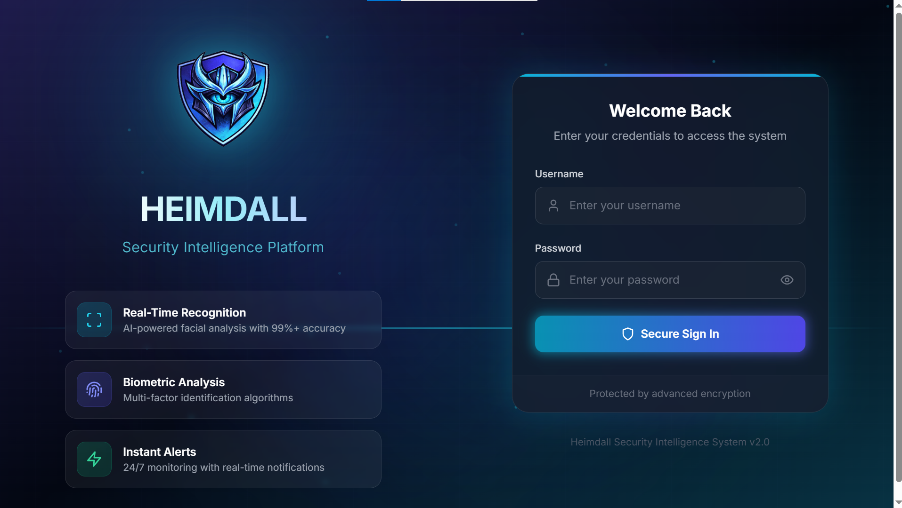
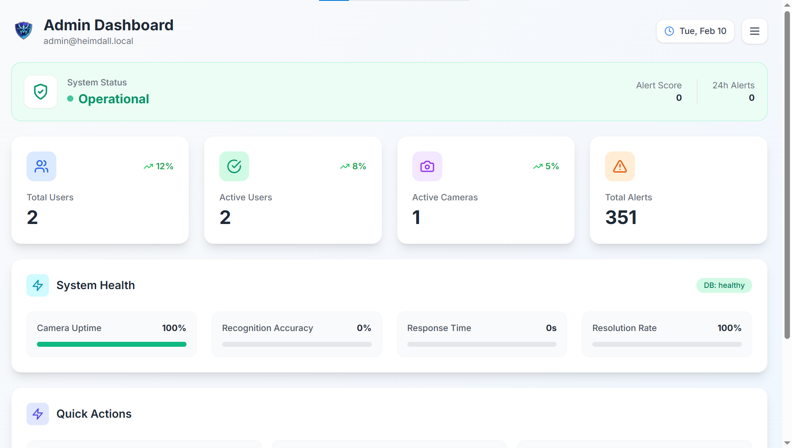
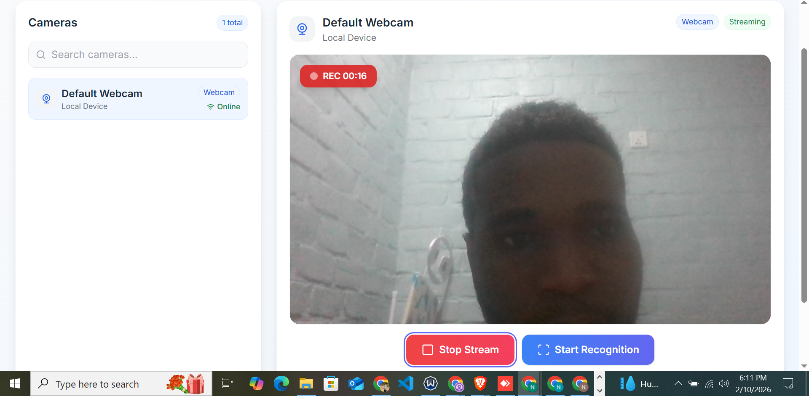
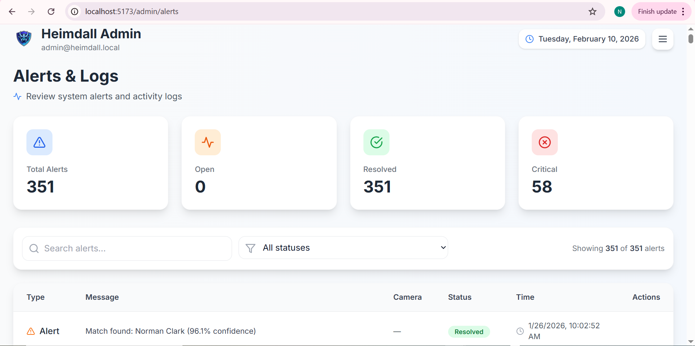

# Heimdall - AI-Powered Facial Recognition Security System

A real-time facial recognition and criminal detection system designed to improve security at high-risk locations such as correctional facilities, government buildings, and secure zones.

## GitHub Repository

**Repository URL:** https://github.com/flammarionick/Heimdall-project.git


## Description

Heimdall is an AI-powered security system that leverages deep learning for facial recognition to identify individuals in real-time. The system is named after the Norse god who guards the Bifrost bridge, symbolizing its role as a vigilant security guardian.

### Problem Statement
Traditional security systems rely heavily on manual monitoring, which is prone to human error and fatigue. Heimdall addresses this by providing automated, real-time facial recognition that can instantly identify known individuals against a database.

### Solution
- **Deep Learning Model:** FaceNet with InceptionResnetV1 backbone and ArcFace loss
- **Real-time Processing:** Live camera feed analysis for instant recognition
- **Web Interface:** Modern React-based dashboard for security personnel
- **Alert System:** Automated notifications when persons of interest are detected


## Features

- **Real-time Facial Recognition** - Live camera feed processing with instant identification
- **Image Upload Recognition** - Upload images for facial matching against the database
- **Inmate Profile Management** - CRUD operations for managing person records
- **Admin Dashboard** - Comprehensive overview with statistics and quick actions
- **User Management** - Role-based access control (Admin/User)
- **Alert System** - Real-time notifications for matches and security events
- **Analytics Dashboard** - Visual metrics and recognition statistics
- **Camera Management** - Configure and manage multiple camera feeds


## Tech Stack

| Component | Technology |
|-----------|------------|
| **Frontend** | React 18, Vite, TailwindCSS |
| **Backend** | Flask (Python), SQLAlchemy |
| **ML Framework** | PyTorch, facenet-pytorch |
| **Database** | SQLite (development), PostgreSQL (production) |
| **Face Detection** | MTCNN (Multi-task Cascaded CNN) |
| **Face Recognition** | FaceNet/InceptionResnetV1 + ArcFace |


## Model Architecture

### FaceNet with InceptionResnetV1

The facial recognition system uses a pre-trained InceptionResnetV1 model fine-tuned with ArcFace loss for enhanced discrimination between faces.

```
Input Image (160x160x3)
        │
        ▼
┌─────────────────────┐
│    MTCNN Detector   │  ← Face Detection & Alignment
└─────────────────────┘
        │
        ▼
┌─────────────────────┐
│ InceptionResnetV1   │  ← Feature Extraction
│  (Pre-trained on    │
│   VGGFace2)         │
└─────────────────────┘
        │
        ▼
┌─────────────────────┐
│   512-D Embedding   │  ← Face Embedding Vector
└─────────────────────┘
        │
        ▼
┌─────────────────────┐
│  ArcFace Loss       │  ← Angular Margin for Better Separation
│  (s=64, m=0.5)      │
└─────────────────────┘
        │
        ▼
┌─────────────────────┐
│ Cosine Similarity   │  ← Distance Computation
│ Threshold: 0.45     │
└─────────────────────┘
```

### Key Hyperparameters

| Parameter | Value |
|-----------|-------|
| Input Size | 160 x 160 |
| Embedding Dimension | 512 |
| ArcFace Scale (s) | 64 |
| ArcFace Margin (m) | 0.5 |
| Similarity Threshold | 0.45 |
| Batch Size | 32 |


## Performance Metrics

Evaluated on 105 registered individuals across 1,500 test images under various conditions:

| Condition | Accuracy | Confidence |
|-----------|----------|------------|
| **Original (Clean)** | 100.00% | 100.0% |
| **Rotation (30°)** | 100.00% | 99.6% |
| **Grayscale** | 100.00% | 100.0% |
| **Dark/Low Light** | 99.05% | 92.2% |
| **Low Resolution (48px)** | 98.10% | 94.0% |
| **Blur (σ=11)** | 92.38% | 84.8% |
| **Noise (σ=30)** | 13.33% | 93.2% |
| **Combined Distortions** | 15.24% | 93.5% |

### Key Findings
- **Excellent performance** on clean images, rotation, and grayscale conversion
- **Strong robustness** to low light and resolution reduction
- **Moderate degradation** under blur conditions
- **Known limitation:** High Gaussian noise significantly impacts accuracy


## Setup Instructions

### Prerequisites

- Python 3.10 or higher
- Node.js 18+ and npm
- Git
- A webcam (for live recognition features)

### Backend Setup

1. **Clone the repository:**
   ```bash
   git clone https://github.com/flammarionick/Heimdall-project.git
   cd Heimdall-project/backend
   ```

2. **Create and activate virtual environment:**
   ```bash
   python -m venv venv

   # Windows
   venv\Scripts\activate

   # macOS/Linux
   source venv/bin/activate
   ```

3. **Install Python dependencies:**
   ```bash
   pip install -r requirements.txt
   ```

4. **Configure environment variables:**
   Create a `.env` file in the `backend/` directory:
   ```env
   FLASK_APP=run.py
   FLASK_ENV=development
   SECRET_KEY=your_secret_key_here
   DATABASE_URL=sqlite:///heimdall.db
   ```

5. **Initialize the database:**
   ```bash
   flask db upgrade
   ```

6. **Download the ML model:**
   The pre-trained model should be in `backend/models/`. If not present, it will be downloaded automatically on first run.

7. **Start the backend server:**
   ```bash
   python run.py
   ```
   The API will be available at `http://localhost:5000`

### Frontend Setup

1. **Navigate to frontend directory:**
   ```bash
   cd ../frontend
   ```

2. **Install dependencies:**
   ```bash
   npm install
   ```

3. **Start the development server:**
   ```bash
   npm run dev
   ```
   The frontend will be available at `http://localhost:5173`

### Default Login Credentials

| Role | Username | Password |
|------|----------|----------|
| Admin | admin | admin123 |


## Deployment Plan

### Production Deployment Architecture

```
┌─────────────────────────────────────────────────────────────┐
│                         NGINX                                │
│                    (Reverse Proxy + SSL)                     │
└─────────────────────────────────────────────────────────────┘
                    │                    │
                    ▼                    ▼
        ┌───────────────────┐  ┌───────────────────┐
        │   React Frontend  │  │   Flask Backend   │
        │   (Static Build)  │  │   (Gunicorn)      │
        └───────────────────┘  └───────────────────┘
                                        │
                    ┌───────────────────┼───────────────────┐
                    ▼                   ▼                   ▼
            ┌─────────────┐    ┌─────────────┐    ┌─────────────┐
            │ PostgreSQL  │    │   Redis     │    │    Model    │
            │  Database   │    │   Cache     │    │   Storage   │
            └─────────────┘    └─────────────┘    └─────────────┘
```

### Deployment Steps

1. **Build Frontend for Production:**
   ```bash
   cd frontend
   npm run build
   ```

2. **Configure Production Server:**
   - Use Gunicorn with multiple workers for Flask
   - Set up NGINX as reverse proxy
   - Enable SSL/TLS certificates

3. **Database Migration:**
   - Migrate from SQLite to PostgreSQL
   - Configure connection pooling

4. **Environment Configuration:**
   - Set `FLASK_ENV=production`
   - Configure secure SECRET_KEY
   - Enable CORS restrictions

5. **Monitoring:**
   - Set up logging with ELK stack or CloudWatch
   - Configure health checks
   - Set up alerting for system issues

### Cloud Platform Options

| Platform | Pros | Cons |
|----------|------|------|
| **AWS EC2** | Full control, GPU support | Higher cost, more setup |
| **Render** | Easy deployment, free tier | Limited GPU support |
| **Railway** | Simple setup, good for demos | Resource limitations |
| **DigitalOcean** | Cost-effective, good GPU options | Manual scaling |

---

## Live Demo

Video Link: https://youtu.be/ciJesdBe9RU

## Project Structure

```
Heimdall-project/
├── backend/
│   ├── app/
│   │   ├── models/          # Database models
│   │   ├── routes/          # API endpoints
│   │   ├── services/        # Business logic
│   │   └── utils/           # Helper functions
│   ├── models/              # ML model files
│   ├── training/            # Training notebooks & scripts
│   │   ├── Heimdall_ML_Demo.ipynb
│   │   └── scripts/
│   └── requirements.txt
├── frontend/
│   ├── src/
│   │   ├── components/      # React components
│   │   ├── pages/           # Page components
│   │   └── services/        # API services
│   └── package.json
└── README.md
```


## Screenshots

### Login Page
Secure authentication interface with animated security-themed background.



### Admin Dashboard
The main dashboard provides an overview of system statistics, recent alerts, and quick actions for administrators.



### Live Monitoring
Real-time camera feeds with face detection overlays and instant recognition alerts.



### Upload Recognition
Upload an image to identify individuals against the registered database with confidence scores.


### Inmate Profiles
Manage the database of registered individuals with photos and personal information.


### Analytics Dashboard
Visual metrics and recognition statistics with interactive charts.




## Future Improvements

1. **GPU Acceleration** - CUDA support for faster inference
2. **Multi-Face Tracking** - Track multiple individuals across camera feeds
3. **Liveness Detection** - Prevent spoofing with photo/video attacks
4. **Mobile App** - Native iOS/Android application for remote monitoring
5. **Edge Deployment** - Run models on edge devices (Jetson Nano, etc.)


## License

This project is developed for educational purposes as part of an academic assignment.


## Author

**Nicholas Eke**

GitHub: [@flammarionick](https://github.com/flammarionick)
